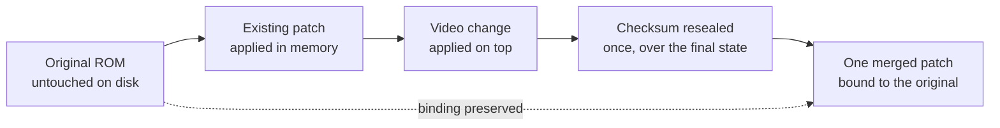

<div align="center">

<strong>Turn an N64 ROM collection into verified Mr. Backup Z64 disk images, and never touch the ROMs.</strong>

<br>
<br>

[](LICENSE.txt)
[](pyproject.toml)
[](tests)
[](pyproject.toml)

</div>

<p align="center">
  <a href="#quick-start">Quick start</a> &nbsp;|&nbsp;
  <a href="#what-it-does">What it does</a> &nbsp;|&nbsp;
  <a href="#the-video-patch-problem">Video patches</a> &nbsp;|&nbsp;
  <a href="#no-copyrighted-content">No ROMs, ever</a> &nbsp;|&nbsp;
  <a href="#commands">Commands</a>
</p>

**10** commands · **22** modules · **543** tests · **97%** coverage · **zero** runtime dependencies · **byte-reproducible** images

```console
$ z64kit doctor
artifact manifest   17 entries
compatibility rules memory limit 32 MiB
TeX engine          tectonic
latex builder       685 byte document renders
volume capacity     100431872 bytes usable
granularity         23 games per disk
```

---

## The problem

The Mr. Backup Z64 loads games from Zip 100 disks through a real-mode DOS shell. That imposes rules
nobody writes down: 8.3 filenames only, FAT16 with partition type `0x06`, one patch per ROM, and a
patch located by comparing the ROM's first 64 bytes against a stored header. Break any of them and
the unit either cannot see the file or loads it without the patch it needs to run.

Filling disks by hand means renaming a thousand games into eight characters while keeping them
recognisable, working out which games fit together so no disk wastes its last 4 MiB, and tracking
which titles need a donor cartridge for their save chip. Then doing it again for the next disk.

## What it does

<table>
<tr>
<td width="50%" valign="top">

### Provably minimal disk count
Every N64 ROM is a multiple of 4 MiB and a disk holds 23 of those units, so the lower bound is
arithmetic rather than a guess. First-fit-decreasing packing reports whether it hit that bound.

</td>
<td width="50%" valign="top">

### 8.3 names you can still read
Candidate generation with scoring, so `The Legend of Zelda: Ocarina of Time` becomes something a
human recognises rather than `LZELDOOT`. Verified against 1,414 real names.

</td>
</tr>
<tr>
<td width="50%" valign="top">

### Byte-reproducible images
No timestamps, no volume serial drift, no filesystem noise. The same input produces the same
SHA-256 on any machine, so an image can be verified rather than trusted.

</td>
<td width="50%" valign="top">

### Video settings without touching the ROM
Anti-aliasing, divot, and gamma dithering can be turned off. The change ships as a patch bound to
the untouched ROM, never as an edit to the file on disk.

</td>
</tr>
<tr>
<td width="50%" valign="top">

### Patch merging
When a game needs a save fix *and* a video change, the two become one patch with one checksum,
because the unit applies exactly one patch per ROM.

</td>
<td width="50%" valign="top">

### Printable catalogues
LaTeX rather than HTML, so a table breaks across pages without orphaning a heading. Monochrome, for
printing on a laser printer and filing with the disks.

</td>
</tr>
<tr>
<td width="50%" valign="top">

### Hardware gap reporting
Which titles need a donor cartridge for a 16 Kbit EEPROM or FlashRAM save, and which need a
different boot chip, as a shopping list rather than a surprise.

</td>
<td width="50%" valign="top">

### Refuses rather than guesses
Every destructive path verifies first: patch bound to the wrong ROM, unverifiable checksum, or an
unprovable mode table all stop the operation and say why.

</td>
</tr>
</table>

## No copyrighted content

The package contains no ROM data, no patch payloads, no firmware, and no save files, and it never
downloads any. What it ships is a manifest of **17** entries describing files you already own by
name, size, SHA-256, CRC32, and target checksums.

That manifest is used to recognise what you have, verify it, and diagnose a mismatch in terms you
can act on. A wrong file produces "this is the headered variant, strip the first 512 bytes", not
"hash mismatch".

> [!IMPORTANT]
> Nothing here helps you obtain a ROM, a BIOS, or a patch. The project identifies files and refuses
> to proceed on the wrong ones. Sourcing them is your problem, and staying legal about it is your
> responsibility.

## Quick start

### Prerequisites

| Tool | Version | Notes |
|:-----|:--------|:------|
| Python | >= 3.11 | Named in [`pyproject.toml`](pyproject.toml). No runtime dependencies |
| tectonic | any | Optional. Only for PDF output; the `.tex` is always written |

### Install

```bash
git clone https://github.com/gufranco/n64-mr-backup-z64-python.git
cd n64-mr-backup-z64-python
pip install -e ".[dev]"
```

### Verify

```bash
z64kit doctor
```

Reports the manifest size, the usable volume capacity in bytes, how many 4 MiB units fit on a disk,
and whether a TeX engine is available. It needs no ROMs, so it is also the fastest check that the
install worked.

### Then

```bash
z64kit scan  ~/roms              # what is here, and what is wrong with any of it
z64kit plan  ~/roms              # which games land on which disk, and whether that is optimal
z64kit organise ~/roms ~/disks   # one folder per disk, renamed, no images
z64kit build ~/roms ~/images     # the disk images, every file verified on the way out
```

## The video patch problem

Turning off anti-aliasing means editing the VI mode table, which lives inside the region the ROM
checksum covers, so the checksum has to be resealed. The checksum sits at offset `0x10`, inside the
first 64 bytes. Those 64 bytes are exactly what the unit compares against a stored header to find a
game's patch.

So editing the ROM would deliver the video change and **silently lose the patch the game needs to
boot**. And a second patch file is not a way out, because one patch is applied per ROM.



The merged patch stores the **original** ROM's checksums, so the binding that locates it stays
exactly as it was. This fires only where the two overlap: a ROM that wants a video change and also
needs a patch to run.

```bash
z64kit vi ~/roms                                   # audit only, writes nothing
z64kit merge game.z64 game.aps --no-aa --output merged.aps --apply
```

> [!NOTE]
> A ROM's filename never affects patch matching. Patches inside the unit's database are located by
> the ROM's first 64 bytes, so renaming to 8.3 is safe. Patches sitting beside a ROM are the
> separate case: those are found by filename and must share the ROM's basename.

## Commands

| Command | Description |
|:--------|:------------|
| `scan` | Report what is in a folder, and what is wrong with any of it |
| `plan` | Show which games land on which disk, and whether that is the minimum |
| `organise` | Write one folder per disk with 8.3 names, no images |
| `build` | Write the disk images, verifying every file on the way out |
| `inventory` | Record which cartridges you have, and what the gaps cost |
| `report` | Write the printable catalogue |
| `vi` | Report the video configuration in each ROM, read only |
| `merge` | Fold a video change into a patch the game already needs |
| `db-update` | Download the save-type catalogue. The only command that uses the network |
| `doctor` | Report what is installed, what is missing, and what each gap costs |

`organise` and `build` are two routes to the same layout. Folders are useful for copying to a disk
by hand, for checking the naming before committing to an image, and for a drive the tool cannot
write to directly.

## Project structure

```
src/z64kit/
  aps.py          # the unit's patch format: parse, apply, build
  merge.py        # fold a video change into an existing patch
  vi.py           # video mode table audit and guarded editing
  naming.py       # 8.3 names that stay recognisable
  packing.py      # 4 MiB granularity and the disk-count lower bound
  artifacts.py    # identify, verify, diagnose user-supplied files
  compat.py       # save-chip and boot-chip rules
  scan.py         # walk a collection
  inventory.py    # which cartridges are owned
  db.py           # save-type catalogue, fetched not bundled
  cli.py          # the command line
  fat/            # FAT16 volume construction and verification
  report/         # LaTeX catalogue and rendering
  rom/            # header parsing and per-CIC checksum
  data/           # manifests. No payloads
```

## For contributors

### Running the tests

| Suite | Command | Covers |
|:------|:--------|:-------|
| Everything | `pytest` | 543 tests, coverage gate at 95% |
| Skip the ones needing game data | `pytest -m "not artifacts"` | Explicit form of what happens anyway when no collection is present |
| Only the ones needing game data | `pytest -m artifacts` | Byte-for-byte image reproduction. Skips unless `Z64KIT_LIBRARY` and `Z64KIT_GOLDEN` resolve |
| Lint and format | `ruff check src tests && ruff format --check src tests` | Style and static analysis |

### Project conventions

| Convention | Source |
|:-----------|:-------|
| Commit format | [Conventional Commits](https://www.conventionalcommits.org/) |
| Lint and format | [ruff](https://docs.astral.sh/ruff/), configured in [`pyproject.toml`](pyproject.toml) |
| Coverage gate | 95%, enforced by [`pyproject.toml`](pyproject.toml) |

### Non-obvious decisions

- **A pure core with an I/O shell.** Header parsing, checksums, naming, packing, and FAT
  construction are pure functions over bytes. That is what lets the suite reach its coverage target
  on a machine with no ROMs, which is the only way CI can run at all.
- **The save-type catalogue is downloaded, not bundled.** It is GPL-3.0 and this package is MIT, so
  bundling it would entangle the licences. `db-update` fetches it and caches it.
- **The operator is configuration, never a constant.** Console region and boot cartridge are
  answers the tool collects. A report generated by someone who owns nothing still reads correctly.
- **Documents are LaTeX, not HTML.** The reports are dense tables that must break across pages
  without orphaning a heading, and the browser route fought that at every turn.
- **SHA-256 alone decides acceptance.** Size and CRC32 are cross-reference aids for looking a file
  up in a public database, never the check itself.

## What has not been verified

The APS format, the patch lookup key, and the merge arithmetic were established by parsing every
patch in a real unit database and requiring each to consume its bytes to exact EOF, then
cross-checking the stored checksums against the paired header. All agreed.

None of it has been run on the hardware. One question in particular is open: when both a patch
beside the ROM and a patch inside the unit's database match the same game, which one wins. Until
that is settled on a real unit, rebuilding the database with the merged patch is the safer delivery
route than dropping a file beside the ROM.

## License

[MIT](LICENSE.txt)
